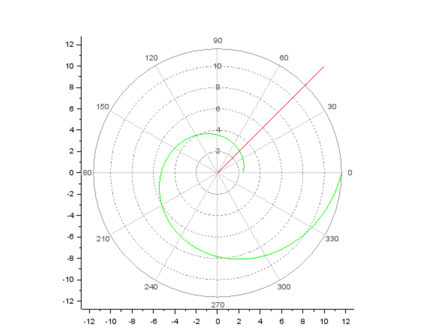

---
# Front matter
lang: ru-RU
title: Защита лабораторной работы №2. Задача о погоне
author: "Асеинова Елизавета Валерьевна"
group: NFIbd-01-19
institute: RUDN University, Moscow, Russian Federation
date: 2022 Feb 15th

# Formatting
toc: false
slide_level: 2
header-includes: 
 - \metroset{progressbar=frametitle,sectionpage=progressbar,numbering=fraction}
 - '\makeatletter'
 - '\beamer@ignorenonframefalse'
 - '\makeatother'
aspectratio: 43
section-titles: true
theme: metropolis

---

# Прагматика выполнения лабораторной работы

- Решение задачи поиска на примере конкретной задачи
- Построение математической модели

# Цель выполнения лабораторной работы 

Построить математическую модель для выбора правильной стратегии при решении задач поиска на примере задачи о преследовании браконьеров береговой охраной.

# Задачи выполнения лабораторной работы

1. Записать уравнение, описывающее движение катера, с начальными условиями для двух случаев.
2. Построить траекторию движения катера и лодки для двух случаев.
3. Найти точку пересечения траектории катера и лодки 

# Теоретические данные 

# Начальные условия для двух случаев задачи
Начальные условия для первого случая: 
$$\left\{ 
\begin{array}{c}
\theta = 0 \\ 
r = \frac{12,2}{5,1} \\ 
\end{array}
\right.$$

для второго случая: 
$$ \left\{ 
\begin{array}{c}
\theta = -\pi \\ 
r = \frac{12,2}{3,1} \\
\end{array}
\right.$$

# Тангенциальная скорость
$$v_t = \sqrt(4,1^2 * v^2 -v^2) = \sqrt(15,81) * v$$

# Основное уравнение задачи

$$\frac{dr}{d\theta} = \frac{r}{\sqrt(15.81)} $$

# Результат выполнения лабораторной работы

# График для первого случая

# График для второго случая

# Выводы по лабораторной работе

- была построена математическая модель для выбора правильной стратегии при решении задач поиска на примере задачи о преследовании браконьеров береговой охраной

- выведены необходимые дифференциальные уравнения для решения данной задачи 

- построены графики для определения траекторий движения лодки и катера

- определены точки пересечения траекторий для двух случаев