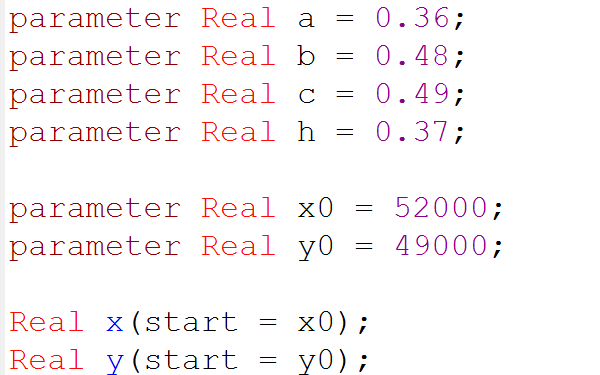
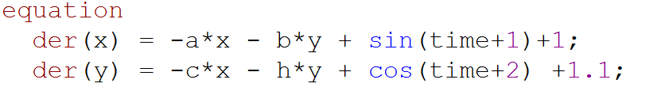
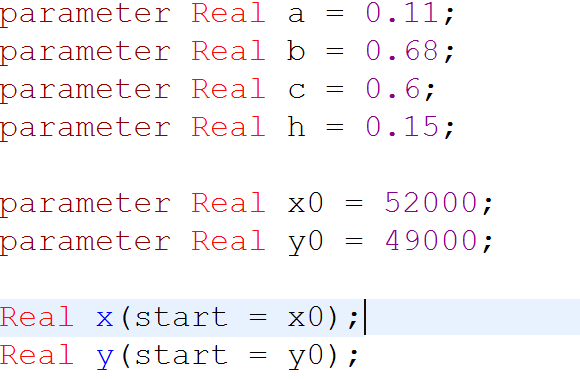
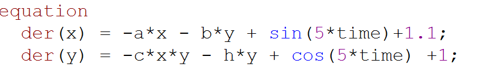

---
# Front matter
title: "Лабораторная работа 3. Модель боевых действий"
subtitle: "Вариант 30"
author: "Асеинова Елизавета Валерьевна"

# Generic otions
lang: ru-RU
toc-title: "Содержание"

# Pdf output format
toc: true # Table of contents
toc_depth: 2
lof: true # List of figures
lot: true # List of tables
fontsize: 12pt
linestretch: 1.5
papersize: a4
documentclass: scrreprt
## I18n
polyglossia-lang:
  name: russian
  options:
	- spelling=modern
	- babelshorthands=true
polyglossia-otherlangs:
  name: english
### Fonts
mainfont: PT Serif
romanfont: PT Serif
sansfont: PT Sans
monofont: PT Mono
mainfontoptions: Ligatures=TeX
romanfontoptions: Ligatures=TeX
sansfontoptions: Ligatures=TeX,Scale=MatchLowercase
monofontoptions: Scale=MatchLowercase,Scale=0.9
## Biblatex
biblatex: true
biblio-style: "gost-numeric"
biblatexoptions:
  - parentracker=true
  - backend=biber
  - hyperref=auto
  - language=auto
  - autolang=other*
  - citestyle=gost-numeric
## Misc options
indent: true
header-includes:
  - \linepenalty=10 # the penalty added to the badness of each line within a paragraph (no associated penalty node) Increasing the value makes tex try to have fewer lines in the paragraph.
  - \interlinepenalty=0 # value of the penalty (node) added after each line of a paragraph.
  - \hyphenpenalty=50 # the penalty for line breaking at an automatically inserted hyphen
  - \exhyphenpenalty=50 # the penalty for line breaking at an explicit hyphen
  - \binoppenalty=700 # the penalty for breaking a line at a binary operator
  - \relpenalty=500 # the penalty for breaking a line at a relation
  - \clubpenalty=150 # extra penalty for breaking after first line of a paragraph
  - \widowpenalty=150 # extra penalty for breaking before last line of a paragraph
  - \displaywidowpenalty=50 # extra penalty for breaking before last line before a display math
  - \brokenpenalty=100 # extra penalty for page breaking after a hyphenated line
  - \predisplaypenalty=10000 # penalty for breaking before a display
  - \postdisplaypenalty=0 # penalty for breaking after a display
  - \floatingpenalty = 20000 # penalty for splitting an insertion (can only be split footnote in standard LaTeX)
  - \raggedbottom # or \flushbottom
  - \usepackage{float} # keep figures where there are in the text
  - \floatplacement{figure}{H} # keep figures where there are in the text
---

# Цель работы

Рассмотреть простейшие модели боевых действий - модели Ланчестера, и построить графики изменения численности войск, используя данные модели

# Задание

Между страной Х и страной Y идет война. Численность состава войск исчисляется от начала войны, и являются временными функциями
x(t) и y(t). В начальный момент времени страна Х имеет армию численностью 52 000 человек, а в распоряжении страны Y армия численностью в 49 000 человек. Для упрощения модели считаем, что коэффициенты a, b, c, h постоянны. Также считаем, что P(t) и Q(t) - непрерывные функции.

Постройте графики изменения численности войск армии Х и армии Y для следующих случаев:
1. Модель боевых действий между регулярными войсками

$$\frac{dx}{dt} = -0,36x(t) - 0,48y(t) + sin(t+1) + 1$$
$$\frac{dy}{dt} = -0,49x(t) - 0,37y(t) + cos(t+2) + 1,1$$

2. Модель ведения боевых действий с участием регулярных войск и партизанских отрядов 

$$\frac{dx}{dt} = -0,11x(t) - 0,68y(t) + sin(5t) + 1,1$$
$$\frac{dy}{dt} = -0,6x(t)y(t) - 0,15y(t) + cos(5t) + 1$$

# Теоретическое введение

Рассматриваются простейшие модели боевых действий – модели
Ланчестера. В противоборстве могут принимать участие как регулярные войска,
так и партизанские отряды. В общем случае главной характеристикой соперников
являются численности сторон. Если в какой-то момент времени одна из
численностей обращается в нуль, то данная сторона считается проигравшей (при
условии, что численность другой стороны в данный момент положительна).

В лабораторной работе рассматриваются два случая ведения боевых действий:
1. Боевые действия между регулярными войсками
2. Боевые действия с участием регулярных войск и партизанских
отрядов 

В первом случае численность регулярных войск определяется тремя
факторами:
- скорость уменьшения численности войск из-за причин, не связанных с боевыми действиями (болезни, травмы, дезертирство)
- скорость потерь, обусловленных боевыми действиями
противоборствующих сторон (что связанно с качеством стратегии,
уровнем вооружения, профессионализмом солдат и т.п.);
- скорость поступления подкрепления (задаётся некоторой функцией от времени).

В этом случае модель боевых действий между регулярными войсками описывается следующим образом:
$$\frac{dx}{dt} = -a(t)x(t) - b(t)y(t) + P(t)$$
$$\frac{dy}{dt} = -c(t)x(t) - h(t)y(t) + Q(t)$$

Потери, не связанные с боевыми действиями, описывают члены *-a(t)x(t)* и *-h(t)y(t)*, члены *-b(t)y(t)* и *-c(t)x(t)* отражают потери на поле боя.
Коэффициенты *b(t) и c(t)* указывают на эффективность боевых действий со стороны у и х соответственно,
*a(t), h(t)* - величины, характеризующие степень
влияния различных факторов на потери. Функции *P(t), Q(t)* учитывают возможность подхода подкрепления к войскам Х и Y в течение одного дня.

Во втором случае в борьбу добавляются партизанские отряды. Нерегулярные войска в отличии от постоянной армии менее уязвимы, так как действуют скрытно, в этом случае сопернику приходится действовать неизбирательно, по площадям,
занимаемым партизанами. Поэтому считается, что тем потерь партизан, проводящих свои операции в разных местах на некоторой известной территории, пропорционален не только численности армейских соединений, но и численности
самих партизан. [^1]

В результате модель принимает вид:

$$\frac{dx}{dt} = -a(t)x(t) - b(t)y(t) + P(t)$$
$$\frac{dy}{dt} = -c(t)x(t)y(t) - h(t)y(t) + Q(t)$$

# Выполнение лабораторной работы

**Модель боевых действий между регулярными войсками**

1. Зададим коэффициенты a, b, c, h, а также численность стран X и Y.(риc.[-@fig:001])

{ #fig:001 width=70%} 

2. Пропишем систему дифференциальных уравнений, отражающих изменений численности первой и второй армии. (риc.[-@fig:002])

{ #fig:002 width=70%} 

3. Построим графики для рассмотренного случая. (риc.[-@fig:003])

{ #fig:003 width=70%} 

По графику видим, что численность армии страны X (выделена красным цветом) будет превосходить численность армии страны Y.

**Модель боевых действий с участием регулярных войск и партизанских отрядов**

1. Зададим коэффициенты a, b, c, h, а также численность стран X и Y.(риc.[-@fig:004])

{ #fig:004 width=70%} 

2. Пропишем систему дифференциальных уравнений, отражающих изменений численности первой и второй армии. (риc.[-@fig:005])

{ #fig:005 width=70%} 

3. Построим графики для рассмотренного случая. (риc.[-@fig:006])

{ #fig:006 width=70%} 

По графику видим, что численность армии страны X (выделена красным цветом) будет превосходить численность армии страны Y, а численность армии Y в один момент обратится в 0, что означает победу армии страны X.

# Выводы 

В данной лабораторной работе мы рассмотрели простейшие модели боевых действий - модели Ланчестера, и построили графики изменения численности войск, используя данные модели. Также мы проанализировали результаты полученных графиков и сделали выводы о численностях армий для каждого рассмотренного случая.

# Список литературы

1. Кулябов, Д.С. Модель боевых действий [Текст] / Д.С.Кулябов. - Москва: - 7 с.

[^1]: Кулябов, Д.С. Модель боевых действий.