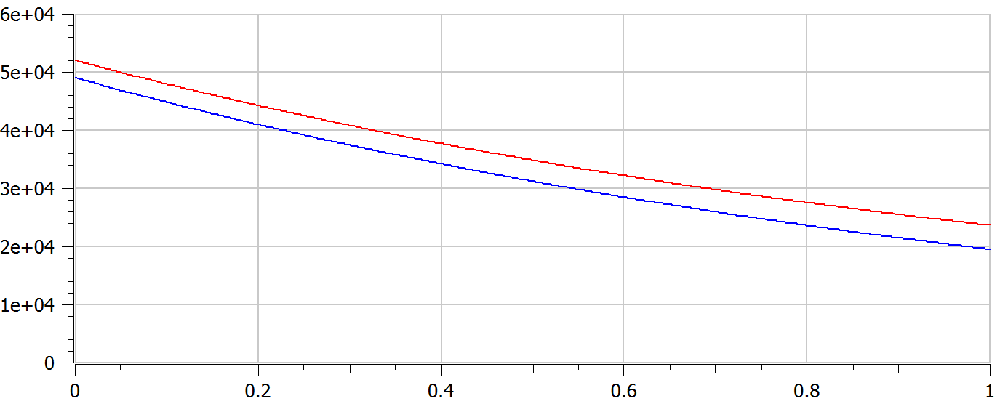
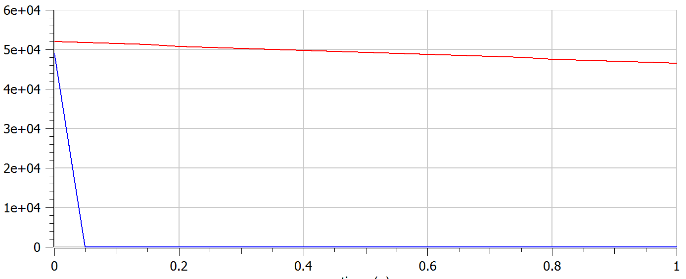

---
# Front matter
lang: ru-RU
title: Защита лабораторной работы №3. Модель боевых действий
author: "Асеинова Елизавета Валерьевна"
group: NFIbd-01-19
institute: RUDN University, Moscow, Russian Federation
date: 2022 Feb 22th

# Formatting
toc: false
slide_level: 2
header-includes: 
 - \metroset{progressbar=frametitle,sectionpage=progressbar,numbering=fraction}
 - '\makeatletter'
 - '\beamer@ignorenonframefalse'
 - '\makeatother'
aspectratio: 43
section-titles: true
theme: metropolis

---

# Прагматика выполнения лабораторной работы

- Изучение моделей Ланчестера
- Построение графиков моделей боевых действий

# Цель выполнения лабораторной работы 

Рассмотреть простейшие модели боевых действий - модели Ланчестера, и построить графики изменения численности войск, используя данные модели

# Задачи выполнения лабораторной работы

1. Проверить, как работает модель в различных ситуациях
2. Построить графики y(t) и x(t) в рассматриваемых случаях
3. Проанализировать полученные графики

# Данные для двух случаев задачи

# Данные для модели боевых действий между регулярными войсками 

$$\frac{dx}{dt} = -0,36x(t) - 0,48y(t) + sin(t+1) + 1$$
$$\frac{dy}{dt} = -0,49x(t) - 0,37y(t) + cos(t+2) + 1,1$$

# Данные для модели боевых действий с участием регулярных войск и партизанских отрядов

$$\frac{dx}{dt} = -0,11x(t) - 0,68y(t) + sin(5t) + 1,1$$
$$\frac{dy}{dt} = -0,6x(t)y(t) - 0,15y(t) + cos(5t) + 1$$

# Результат выполнения лабораторной работы

# График для первого случая

# График для второго случая

# Выводы по лабораторной работе

- были рассмотрены простейшие модели боевых действий - модели Ланчестера
- построены графики изменения численности войск в среде OpenModelica
- проанализированы полученные графики и сделаны выводы о численности армий в каждом случае