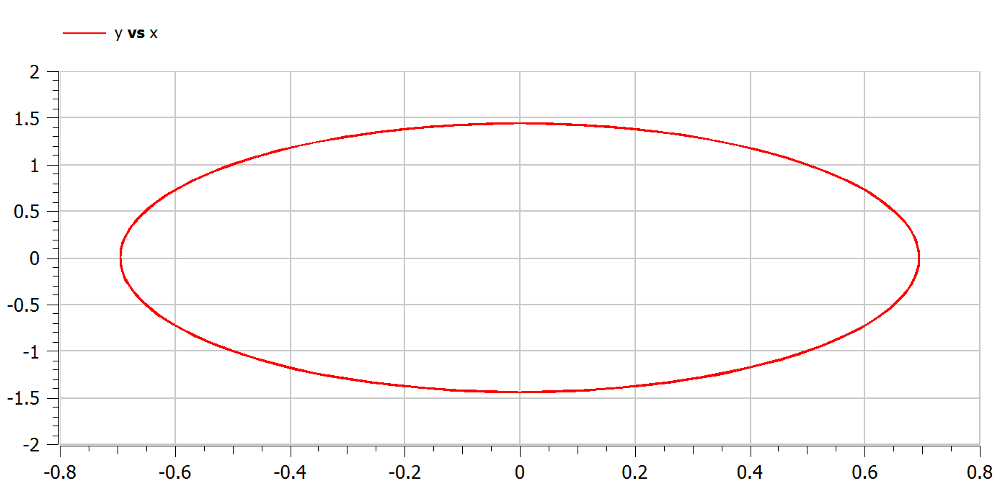
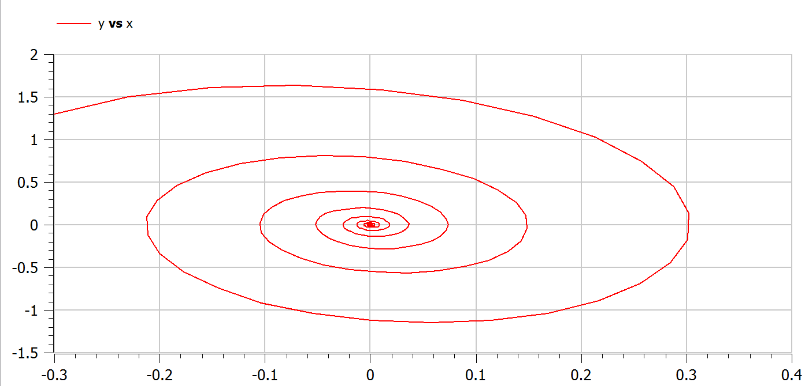
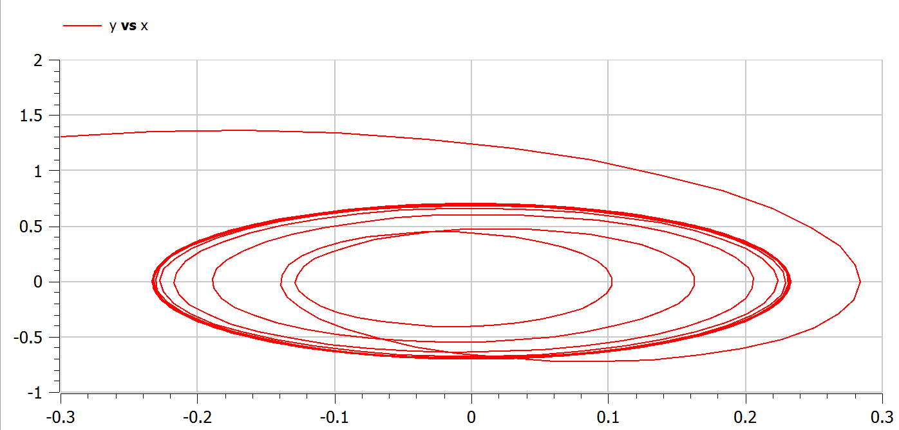

---
# Front matter
lang: ru-RU
title: Защита лабораторной работы №4. Модель гармонических колебаний
author: "Асеинова Елизавета Валерьевна"
group: NFIbd-01-19
institute: RUDN University, Moscow, Russian Federation
date: 2022 March 1th

# Formatting
toc: false
slide_level: 2
header-includes: 
 - \metroset{progressbar=frametitle,sectionpage=progressbar,numbering=fraction}
 - '\makeatletter'
 - '\beamer@ignorenonframefalse'
 - '\makeatother'
aspectratio: 43
section-titles: true
theme: metropolis

---

# Прагматика выполнения лабораторной работы

- Ознакомление с понятиями "фазовый портрет" и "фазовая траектория"
- Ознакомление с моделью под названием "линейный гармонический осциллятор"

# Цель выполнения лабораторной работы 

В данной работе мы должны построить фазовый портрет гармонического осциллятора и решение уравнения гармонического осциллятора для нескольких случаев в среде OpenModelica.

# Задачи выполнения лабораторной работы

1. Построить решение уравнения гармонического осциллятора без затухания.
2. Записать уравнение свободных колебаний гармонического осциллятора с затуханием, построить его решение. Построить фазовый портрет гармонических колебаний с затуханием.
3. Записать уравнение колебаний гармонического осциллятора, если на систему действует внешняя сила, построить его решение. Построить фазовый портрет колебаний с действием внешней силы.

# Данные для трех случаев задачи

## Общие данные

$$x'' +\gamma x' + \omega_0^2x = 0$$

Начальные условия:  $x_0 = -0.3$ , $y_0 = 1.3$

Интервал $t\in [0;61]$ с шагом 0.05

## Данные для первого случая

$$x''+4.3x = 0$$

## Данные для второго случая 

$$x'' + x' + 20x = 0 $$

## Данные для третьего случая 

$$x'' + x' + 8.8x = 0.7sin(3t) $$

# Результат выполнения лабораторной работы

# График для первого случая

# График для второго случая

# График для третьего случая

# Выводы по лабораторной работе

- было построено решение уравнения гармонического осциллятора без затухания
- построен фазовый портрет гармонических колебаний с затуханием.
- построен фазовый портрет колебаний с действием внешней силы.