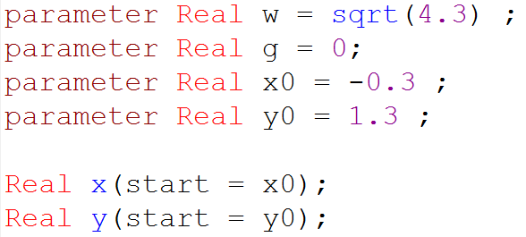
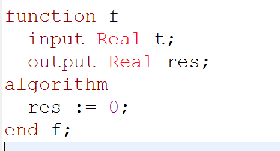
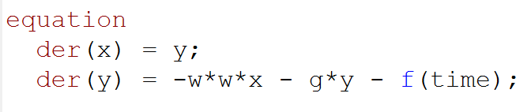
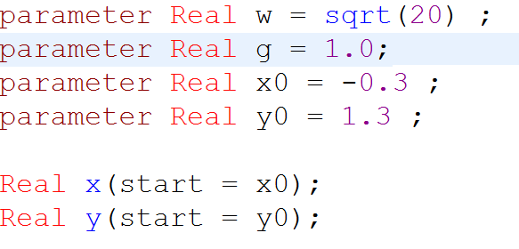
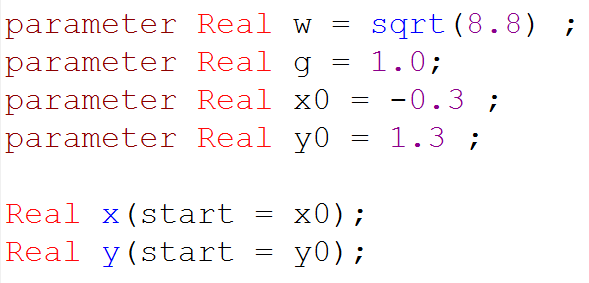
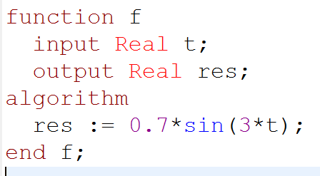

---
# Front matter
title: "Лабораторная работа 4. Модель гармонических колебаний"
subtitle: "Вариант 30"
author: "Асеинова Елизавета Валерьевна"

# Generic otions
lang: ru-RU
toc-title: "Содержание"

# Pdf output format
toc: true # Table of contents
toc_depth: 2
lof: true # List of figures
lot: true # List of tables
fontsize: 12pt
linestretch: 1.5
papersize: a4
documentclass: scrreprt
## I18n
polyglossia-lang:
  name: russian
  options:
	- spelling=modern
	- babelshorthands=true
polyglossia-otherlangs:
  name: english
### Fonts
mainfont: PT Serif
romanfont: PT Serif
sansfont: PT Sans
monofont: PT Mono
mainfontoptions: Ligatures=TeX
romanfontoptions: Ligatures=TeX
sansfontoptions: Ligatures=TeX,Scale=MatchLowercase
monofontoptions: Scale=MatchLowercase,Scale=0.9
## Biblatex
biblatex: true
biblio-style: "gost-numeric"
biblatexoptions:
  - parentracker=true
  - backend=biber
  - hyperref=auto
  - language=auto
  - autolang=other*
  - citestyle=gost-numeric
## Misc options
indent: true
header-includes:
  - \linepenalty=10 # the penalty added to the badness of each line within a paragraph (no associated penalty node) Increasing the value makes tex try to have fewer lines in the paragraph.
  - \interlinepenalty=0 # value of the penalty (node) added after each line of a paragraph.
  - \hyphenpenalty=50 # the penalty for line breaking at an automatically inserted hyphen
  - \exhyphenpenalty=50 # the penalty for line breaking at an explicit hyphen
  - \binoppenalty=700 # the penalty for breaking a line at a binary operator
  - \relpenalty=500 # the penalty for breaking a line at a relation
  - \clubpenalty=150 # extra penalty for breaking after first line of a paragraph
  - \widowpenalty=150 # extra penalty for breaking before last line of a paragraph
  - \displaywidowpenalty=50 # extra penalty for breaking before last line before a display math
  - \brokenpenalty=100 # extra penalty for page breaking after a hyphenated line
  - \predisplaypenalty=10000 # penalty for breaking before a display
  - \postdisplaypenalty=0 # penalty for breaking after a display
  - \floatingpenalty = 20000 # penalty for splitting an insertion (can only be split footnote in standard LaTeX)
  - \raggedbottom # or \flushbottom
  - \usepackage{float} # keep figures where there are in the text
  - \floatplacement{figure}{H} # keep figures where there are in the text
---

# Цель работы

В данной работе мы должны построить фазовый портрет гармонического осциллятора и решение уравнения гармонического осциллятора для нескольких случаев в среде OpenModelica.

# Задание
Постройте фазовый портрет гармонического осциллятора и решение уравнения  гармонического осциллятора для следующих случаев:
1. Колебания гармонического осциллятора без затуханий и без действий внешней
силы
$$x'' +4.3x = 0$$
2. Колебания гармонического осциллятора c затуханием и без действий внешней силы
$$x'' + x' + 20x = 0 $$
3. Колебания гармонического осциллятора c затуханием и под действием внешней силы
$$x'' + x' + 8.8x = 0.7sin(3t) $$

На интервале $t\in [0;61]$ (шаг 0.05) с начальными условиями
$x_0 = -0.3$ , $y_0 = 1.3$

# Теоретическое введение
Уравнение свободных колебаний гармонического осциллятора имеет
следующий вид:

$$x''+2\gamma x' + \omega_0^2x = 0$$

где x – переменная, описывающая состояние системы, $\gamma$ – параметр, характеризующий потери энергии, $\omega_0$ – собственная частота колебаний, t – время.

Уравнение есть линейное однородное дифференциальное уравнение
второго порядка и оно является примером линейной динамической системы.

При отсутствии потерь в системе вместо данного уравнения получаем уравнение консервативного осциллятора, энергия колебания которого сохраняется во времени.

$$x'' + \omega_0^2x = 0$$

Для однозначной разрешимости данного уравнения второго порядка необходимо задать два начальных условия:
$$x(t_0) = x_0$$
$$x'(t_0) = y_0$$

Уравнение второго порядка можно представить в виде системы двух уравнений первого порядка, тогда начальные условия примут следующий вид:
$$x(t_0) = x_0$$
$$y(t_0) = y_0$$

Независимые переменные x, y определяют пространство, в котором
«движется» решение. Это фазовое пространство системы, поскольку оно двумерно будем называть его фазовой плоскостью.
Значение фазовых координат x, y в любой момент времени полностью определяет состояние системы. Решению уравнения движения как функции времени отвечает гладкая кривая в фазовой плоскости. Она называется фазовой
траекторией. Если множество различных решений (соответствующих различным 
начальным условиям) изобразить на одной фазовой плоскости, возникает общая картина поведения системы. Такую картину, образованную набором фазовых траекторий, называют фазовым портретом.[^1]

# Выполнение лабораторной работы

**Колебания гармонического осциллятора без затуханий и без действий внешней силы**

1. Задаём частоту и затухание, а также начальные условия для уравнения.(риc.[-@fig:001])

{ #fig:001 width=70%} 

2. Прописываем функцию f - правая часть нашего уравнения.(риc.[-@fig:002])

{ #fig:002 width=70%} 

3. Прописываем дифференциальные уравнения.(риc.[-@fig:003]

{ #fig:003 width=70%} 

4. Получаем фазовый портрет для первого случая.(риc.[-@fig:004]

{ #fig:004 width=70%} 

**Колебания гармонического осциллятора с затуханием и без действий внешней силы**

1. Задаём частоту и затухание, а также начальные условия для уравнения.(риc.[-@fig:005])

{ #fig:005 width=70%} 

2. Прописываем функцию f - правая часть нашего уравнения.(риc.[-@fig:006])

{ #fig:006 width=70%} 

3. Прописываем дифференциальные уравнения.(риc.[-@fig:007]

{ #fig:007 width=70%} 

4. Получаем фазовый портрет для второго случая.(риc.[-@fig:008]

{ #fig:008 width=70%} 

**Колебания гармонического осциллятора с затуханием и с  воздействием внешней силы**

1. Задаём частоту и затухание, а также начальные условия для уравнения.(риc.[-@fig:009])

{ #fig:009 width=70%} 

2. Прописываем функцию f - правая часть нашего уравнения.(риc.[-@fig:010])

{ #fig:010 width=70%} 

3. Прописываем дифференциальные уравнения.(риc.[-@fig:011]

{ #fig:011 width=70%} 

4. Получаем фазовый портрет для третьего случая.(риc.[-@fig:012]

{ #fig:012 width=70%} 

# Выводы 

В данной лабораторной работе мы построили фазовые портреты гармонического осциллятора и решение уравнения гармонического осциллятора для трех различных случаев, а также познакомились с понятиями фазового портрета и фазовой траектории. 

# Список литературы

1. Кулябов, Д.С. Модель гармонических колебаний [Текст] / Д.С.Кулябов. - Москва: - 4 с.

[^1]: Кулябов, Д.С. Модель гармонических колебаний.