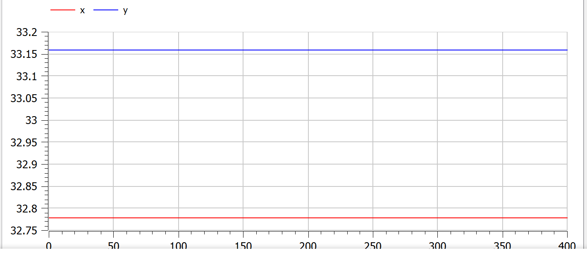

---
# Front matter
lang: ru-RU
title: Защита лабораторной работы №5. Модель хищник-жертва
author: "Асеинова Елизавета Валерьевна"
group: NFIbd-01-19
institute: RUDN University, Moscow, Russian Federation
date: 2022 March 10th

# Formatting
toc: false
slide_level: 2
header-includes: 
 - \metroset{progressbar=frametitle,sectionpage=progressbar,numbering=fraction}
 - '\makeatletter'
 - '\beamer@ignorenonframefalse'
 - '\makeatother'
aspectratio: 43
section-titles: true
theme: metropolis

---

# Прагматика выполнения лабораторной работы

- Ознакомление с моделью под названием "хищник-жертва"
- Построение графиков для данной модели

# Цель выполнения лабораторной работы 

В данной работе мы должны изучить модель хищник-жертва и построить графики в среде OpenModelica.

# Задачи выполнения лабораторной работы

1. Построить график зависимости численности хищников от численности жертв

2. Построить графики изменения численности хищников и численности жертв при заданных начальных условиях

3. Найти стационарное состояние системы

# Уравнение модели

$$ \left\{
\begin{array}{c}
\frac{dx}{dt} = -0.63x(t)+0.019x(t)y(t) \\
\frac{dy}{dt} = 0.59y(t) - 0.018x(t)y(t) \\
\end{array}
\right.$$

В этой модели x – число жертв, y - число хищников. Коэффициент a - скорость естественного прироста числа жертв в отсутствие хищников, с - естественное вымирание хищников, лишенных пищи в виде жертв.

# Результат выполнения лабораторной работы

# График зависимости численности хищников от численности жертв

# Графики изменения численности хищников и численности жертв при заданных начальных условиях

# Стационарное состояние системы

# Выводы по лабораторной работе

- изучена модель хищник-жертва 

- был построен график зависимости численности хищников от численности жертв

- были построены графики изменения численности хищников и численности жертв при заданных начальных условиях

- найдено стационарное состояние системы