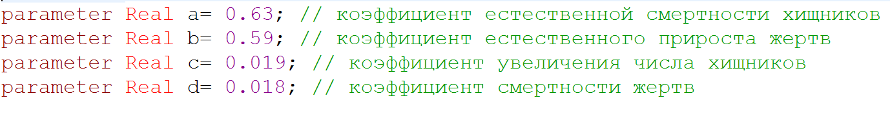
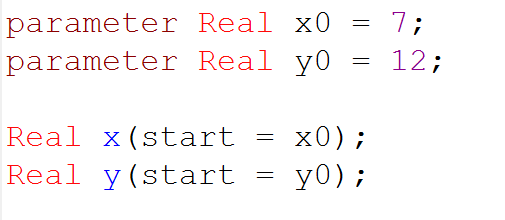
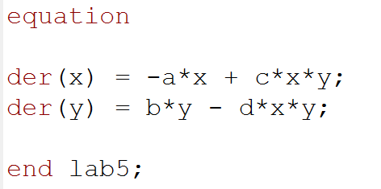
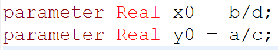

---
# Front matter
title: "Лабораторная работа 5. Модель хищник-жертва"
subtitle: "Вариант 30"
author: "Асеинова Елизавета Валерьевна"

# Generic otions
lang: ru-RU
toc-title: "Содержание"

# Pdf output format
toc: true # Table of contents
toc_depth: 2
lof: true # List of figures
lot: true # List of tables
fontsize: 12pt
linestretch: 1.5
papersize: a4
documentclass: scrreprt
## I18n
polyglossia-lang:
  name: russian
  options:
	- spelling=modern
	- babelshorthands=true
polyglossia-otherlangs:
  name: english
### Fonts
mainfont: PT Serif
romanfont: PT Serif
sansfont: PT Sans
monofont: PT Mono
mainfontoptions: Ligatures=TeX
romanfontoptions: Ligatures=TeX
sansfontoptions: Ligatures=TeX,Scale=MatchLowercase
monofontoptions: Scale=MatchLowercase,Scale=0.9
## Biblatex
biblatex: true
biblio-style: "gost-numeric"
biblatexoptions:
  - parentracker=true
  - backend=biber
  - hyperref=auto
  - language=auto
  - autolang=other*
  - citestyle=gost-numeric
## Misc options
indent: true
header-includes:
  - \linepenalty=10 # the penalty added to the badness of each line within a paragraph (no associated penalty node) Increasing the value makes tex try to have fewer lines in the paragraph.
  - \interlinepenalty=0 # value of the penalty (node) added after each line of a paragraph.
  - \hyphenpenalty=50 # the penalty for line breaking at an automatically inserted hyphen
  - \exhyphenpenalty=50 # the penalty for line breaking at an explicit hyphen
  - \binoppenalty=700 # the penalty for breaking a line at a binary operator
  - \relpenalty=500 # the penalty for breaking a line at a relation
  - \clubpenalty=150 # extra penalty for breaking after first line of a paragraph
  - \widowpenalty=150 # extra penalty for breaking before last line of a paragraph
  - \displaywidowpenalty=50 # extra penalty for breaking before last line before a display math
  - \brokenpenalty=100 # extra penalty for page breaking after a hyphenated line
  - \predisplaypenalty=10000 # penalty for breaking before a display
  - \postdisplaypenalty=0 # penalty for breaking after a display
  - \floatingpenalty = 20000 # penalty for splitting an insertion (can only be split footnote in standard LaTeX)
  - \raggedbottom # or \flushbottom
  - \usepackage{float} # keep figures where there are in the text
  - \floatplacement{figure}{H} # keep figures where there are in the text
---

# Цель работы

В данной работе мы должны изучить модель хищник-жертва и построить графики в среде OpenModelica.

# Задание
В лесу проживают 7  волков, питающихся зайцами, число которых в этом же лесу 12. Пока число зайцев достаточно велико, для прокормки всех волков, численность волков растет до тех пор, пока не наступит момент, что корма перестанет хватать на всех. Тогда волки начнут умирать, и их численность будет уменьшаться. В этом случае в какой-то момент времени численность зайцев снова начнет увеличиваться, что повлечет за собой новый рост популяции волков. Такой цикл будет повторяться, пока обе популяции будут существовать. Помимо этого, на численность стаи влияют болезни и старение. Данная модель описывается следующим уравнением:

$$ \left\{
\begin{array}{c}
\frac{dx}{dt} = -0.63x(t)+0.019x(t)y(t) \\
\frac{dy}{dt} = 0.59y(t) - 0.018x(t)y(t) \\
\end{array}
\right.$$

Для данной модели нужно построить график зависимости численности хищников от численности жертв, а также графики изменения численности хищников и численности жертв при заданных начальных условиях. Найти стационарное
состояние системы.

# Теоретическое введение
Простейшая модель взаимодействия двух видов типа «хищник — жертва» - модель Лотки-Вольтерры. Данная двувидовая модель основывается на следующих предположениях:
1. Численность популяции жертв x и хищников y зависят только от времени (модель не учитывает пространственное распределение популяции на занимаемой территории)
2. В отсутствии взаимодействия численность видов изменяется по модели Мальтуса, при этом число жертв увеличивается, а число хищников падает
3. Естественная смертность жертвы и естественная рождаемость хищника считаются несущественными
4. Эффект насыщения численности обеих популяций не учитывается
5. Скорость роста численности жертв уменьшается пропорционально численности хищников

$$ \left\{
\begin{array}{c}
\frac{dx}{dt} = ax(t)-bx(t)y(t) \\
\frac{dy}{dt} = -cy(t) + dx(t)y(t) \\
\end{array}
\right.$$

В этой модели x – число жертв, y - число хищников. Коэффициент a описывает скорость естественного прироста числа жертв в отсутствие хищников, с - естественное вымирание хищников, лишенных пищи в виде жертв. Вероятность
взаимодействия жертвы и хищника считается пропорциональной как количеству жертв, так и числу самих хищников (xy). Каждый акт взаимодействия уменьшает популяцию жертв, но способствует увеличению популяции хищников (члены -bxy и dxy в правой части уравнения).[^1]

Математический анализ этой  модели показывает, что имеется
стационарное состояние, всякое же другое начальное состояние
приводит к периодическому колебанию численности как жертв, так и хищников, так что по прошествии некоторого времени система возвращается в состояние B.
Стационарное состояние системы будет в точке: $x_0 = \frac{c}{d}$, $y_0 = \frac{a}{b}$

# Выполнение лабораторной работы

## Зависимость численности хищников от численности жертв и изменение численности хищников и численности жертв 

1. Задаем коэффициенты системы.(риc.[-@fig:001])

{ #fig:001 width=70%}

2. Задаём начальные условия. (риc.[-@fig:002])

{ #fig:002 width=70%}

3. Прописываем систему уравнений. (риc.[-@fig:003])

{ #fig:003 width=70%}

4. Получаем графики зависимости численности хищников от численности жертв и изменения численности хищников и численности жертв. (риc.[-@fig:004])

{ #fig:004 width=70%}

{ #fig:005 width=70%}

## Стационарное состояние системы

1. Задаем коэффициенты системы.(риc.[-@fig:006])

{ #fig:006 width=70%}

2. Задаём начальные условия. (риc.[-@fig:007])

{ #fig:007 width=70%}

3. Прописываем систему уравнений. (риc.[-@fig:008])

{ #fig:008 width=70%}

4. Получаем стационарное состояние системы. (риc.[-@fig:009])

{ #fig:009 width=70%}

# Выводы 

В данной лабораторной работе мы изучили модель хищник-жертва и построили графики зависимость численности хищников от численности жертв и изменения численности хищников и численности жертв, а также нашли стационарное состояние системы в среде OpenModelica с заданными коэффициентами и начальными условиями.

# Список литературы

1. Кулябов, Д.С. Модель хищник-жертва [Текст] / Д.С.Кулябов. - Москва: - 5 с.

[^1]: Кулябов, Д.С. Модель хищник-жертва.