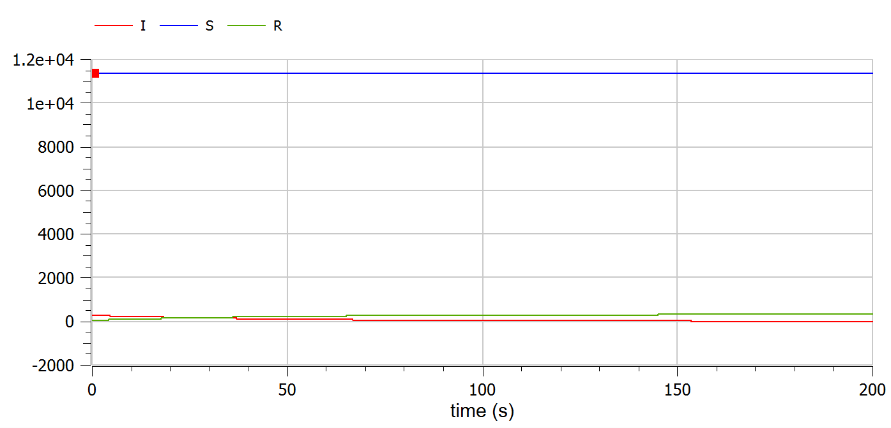
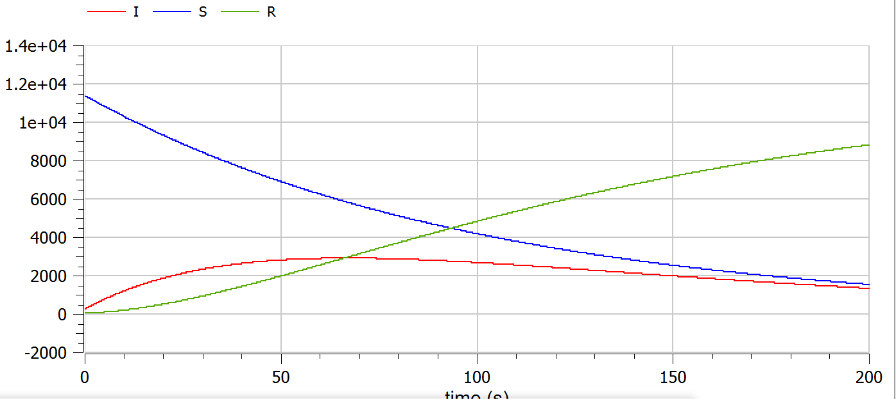

---
# Front matter
lang: ru-RU
title: Защита лабораторной работы №6. Задача об эпидемии
author: "Асеинова Елизавета Валерьевна"
group: NFIbd-01-19
institute: RUDN University, Moscow, Russian Federation
date: 2022 March 16th

# Formatting
toc: false
slide_level: 2
header-includes: 
 - \metroset{progressbar=frametitle,sectionpage=progressbar,numbering=fraction}
 - '\makeatletter'
 - '\beamer@ignorenonframefalse'
 - '\makeatother'
aspectratio: 43
section-titles: true
theme: metropolis

---

# Прагматика выполнения лабораторной работы

- Ознакомление с задачей об эпидемии
- Построение графиков для двух случаев задачи

# Цель выполнения лабораторной работы 

В данной работе мы должны изучить задачу об эпидемии и построить графики в среде OpenModelica.

# Задачи выполнения лабораторной работы

1. Построить графики изменения числа особей в каждой из трех групп.
2. Рассмотреть, как будет протекать эпидемия в двух различных случаях. 

# Начальные данные для задачи

$$a = 0.01, b = 0.02$$
$$N = 11700$$
$$I_0 = 270, R_0 = 49$$
$$S_0 = N-I_0-R_0$$

## Cкорость изменения числа здоровых особей

$$ \frac{dS}{dt} =  \left\{
\begin{array}{c}
-\alpha S, I(t) > I^* \\
0, I(t)\leq I^*   \\
\end{array}
\right.$$

## Cкорость изменения числа инфицированных особей

$$ \frac{dI}{dt} =  \left\{
\begin{array}{c}
\alpha S - \beta I, I(t) > I^* \\ 
-\beta I, I(t)\leq I^*   \\
\end{array}
\right.$$

## Cкорость изменения числа здоровых особей с иммунитетом

$$\frac{dR}{dt} = \beta I $$

# Результат выполнения лабораторной работы

# График для случая $I(0)\leq I^*$

# График для случая $I(0) > I^*$

# Выводы по лабораторной работе

- изучена задача об эпидемии

- был построен график для случая $I(0)\leq I^*$

- был построен график для случая $I(0) > I^*$
