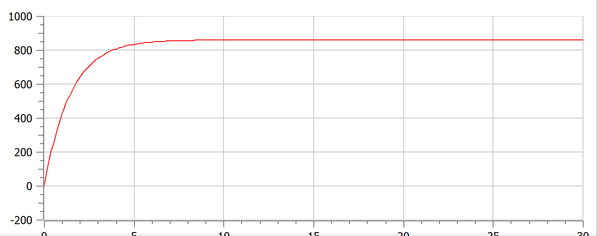
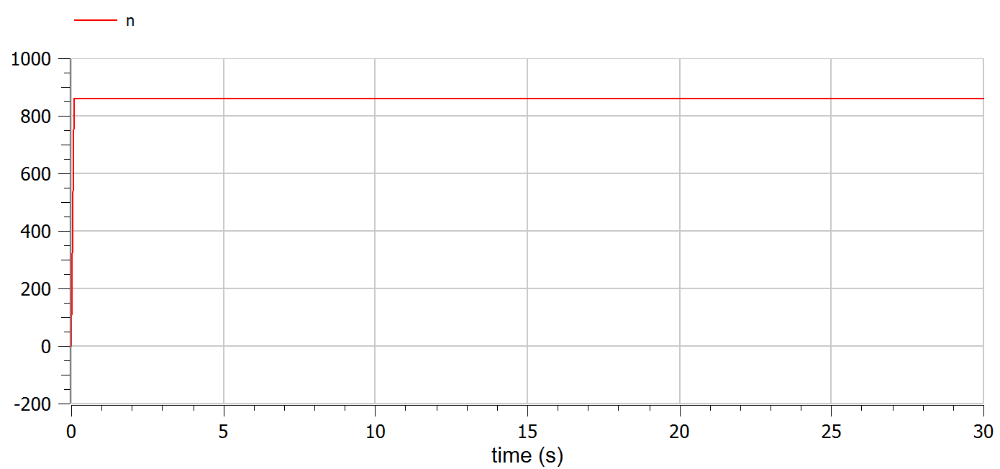
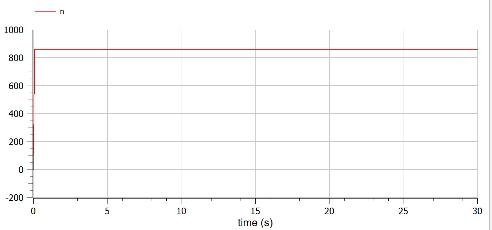

---
# Front matter
lang: ru-RU
title: Защита лабораторной работы №7. Эффективность рекламы
author: "Асеинова Елизавета Валерьевна"
group: NFIbd-01-19
institute: RUDN University, Moscow, Russian Federation
date: 2022 March 25th

# Formatting
toc: false
slide_level: 2
header-includes: 
 - \metroset{progressbar=frametitle,sectionpage=progressbar,numbering=fraction}
 - '\makeatletter'
 - '\beamer@ignorenonframefalse'
 - '\makeatother'
aspectratio: 43
section-titles: true
theme: metropolis

---

# Прагматика выполнения лабораторной работы

- Ознакомление с моделью рекламной кампании
- Построение графиков для трех случае

# Цель выполнения лабораторной работы 

В данной работе мы должны изучить задачу эффективности рекламы и построить графики в среде OpenModelica.

# Задачи выполнения лабораторной работы

1. Построить графики распространения рекламы для трех уравнений.
2. Для случая 2 определить в какой момент времени скорость распространения рекламы будет иметь максимальное значение.

## Условие задачи
29 января в городе открылся новый салон красоты. Полагаем, что на момент открытия о салоне знали 2 потенциальных клиента. По маркетинговым исследованиям известно, что в районе проживают 860 потенциальных клиентов
салона. Поэтому после открытия салона руководитель запускает активную рекламную компанию. После этого скорость изменения числа знающих о салонепропорциональна как числу знающих о нем, так и числу не знающих о нем.

## Уравнения

Постройте график распространения рекламы, математическая модель которой описывается следующим уравнением:

1. $\frac{dn}{dt} = (0.66 + 0.000061n(t))(N - n(t))$

2. $\frac{dn}{dt} = (0.000056 + 0.66n(t))(N - n(t))$

3. $\frac{dn}{dt} = (0.66sin(t) + 0.66sin(6t)n(t))(N - n(t)) $

# Результат работы

## График для первого уравнения

## График для второго уравнения

## График для третьего уравнения

# Выводы по лабораторной работе

- изучена модель рекламной кампании

- построены графики для трех уравнений