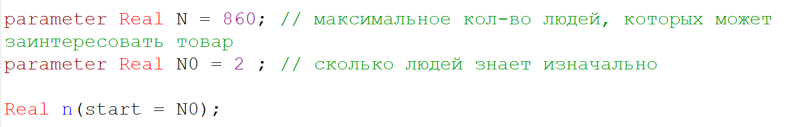
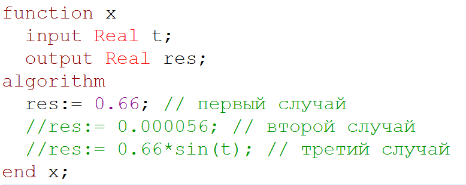
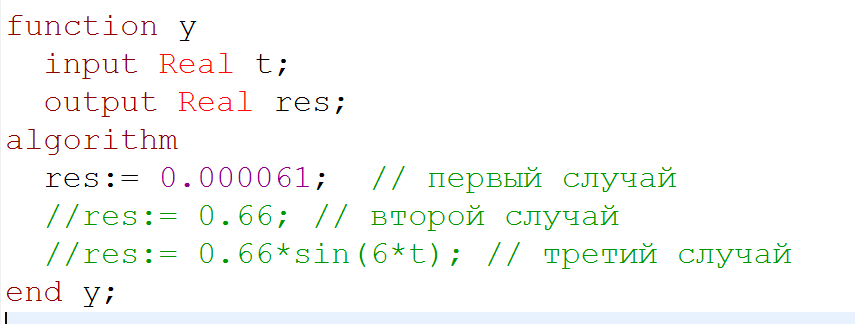
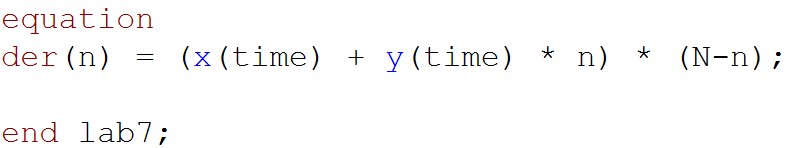

---
# Front matter
title: "Лабораторная работа 7. Эффективность рекламы"
subtitle: "Вариант 30"
author: "Асеинова Елизавета Валерьевна"

# Generic otions
lang: ru-RU
toc-title: "Содержание"

# Pdf output format
toc: true # Table of contents
toc_depth: 2
lof: true # List of figures
lot: true # List of tables
fontsize: 12pt
linestretch: 1.5
papersize: a4
documentclass: scrreprt
## I18n
polyglossia-lang:
  name: russian
  options:
	- spelling=modern
	- babelshorthands=true
polyglossia-otherlangs:
  name: english
### Fonts
mainfont: PT Serif
romanfont: PT Serif
sansfont: PT Sans
monofont: PT Mono
mainfontoptions: Ligatures=TeX
romanfontoptions: Ligatures=TeX
sansfontoptions: Ligatures=TeX,Scale=MatchLowercase
monofontoptions: Scale=MatchLowercase,Scale=0.9
## Biblatex
biblatex: true
biblio-style: "gost-numeric"
biblatexoptions:
  - parentracker=true
  - backend=biber
  - hyperref=auto
  - language=auto
  - autolang=other*
  - citestyle=gost-numeric
## Misc options
indent: true
header-includes:
  - \linepenalty=10 # the penalty added to the badness of each line within a paragraph (no associated penalty node) Increasing the value makes tex try to have fewer lines in the paragraph.
  - \interlinepenalty=0 # value of the penalty (node) added after each line of a paragraph.
  - \hyphenpenalty=50 # the penalty for line breaking at an automatically inserted hyphen
  - \exhyphenpenalty=50 # the penalty for line breaking at an explicit hyphen
  - \binoppenalty=700 # the penalty for breaking a line at a binary operator
  - \relpenalty=500 # the penalty for breaking a line at a relation
  - \clubpenalty=150 # extra penalty for breaking after first line of a paragraph
  - \widowpenalty=150 # extra penalty for breaking before last line of a paragraph
  - \displaywidowpenalty=50 # extra penalty for breaking before last line before a display math
  - \brokenpenalty=100 # extra penalty for page breaking after a hyphenated line
  - \predisplaypenalty=10000 # penalty for breaking before a display
  - \postdisplaypenalty=0 # penalty for breaking after a display
  - \floatingpenalty = 20000 # penalty for splitting an insertion (can only be split footnote in standard LaTeX)
  - \raggedbottom # or \flushbottom
  - \usepackage{float} # keep figures where there are in the text
  - \floatplacement{figure}{H} # keep figures where there are in the text
---

# Цель работы

В данной работе мы должны изучить модель рекламной кампании и построить соответствующие графики в OpenModelica.

# Задание
29 января в городе открылся новый салон красоты. Полагаем, что на момент открытия о салоне знали 2 потенциальных клиента. По маркетинговым исследованиям известно, что в районе проживают 860 потенциальных клиентов
салона. Поэтому после открытия салона руководитель запускает активную рекламную компанию. После этого скорость изменения числа знающих о салонепропорциональна как числу знающих о нем, так и числу не знающих о нем. 

Постройте график распространения рекламы, математическая модель которой описывается следующим уравнением:

1. $\frac{dn}{dt} = (0.66 + 0.000061n(t))(N - n(t))$

2. $\frac{dn}{dt} = (0.000056 + 0.66n(t))(N - n(t))$

3. $\frac{dn}{dt} = (0.66sin(t) + 0.66sin(6t)n(t))(N - n(t))$

# Теоретическое введение
Модель рекламной кампании описывается следующими величинами.
Считаем, что $dn/dt$ - скорость изменения со временем числа потребителей, узнавших о товаре и готовых его купить,
t - время, прошедшее с начала рекламной кампании,
n(t) - число уже информированных клиентов. Эта величина
пропорциональна числу покупателей, еще не знающих о нем, это описывается следующим образом: $\alpha_1(t)(N-n(t))$ , где
N - общее число потенциальных платежеспособных покупателей,
 $\alpha_1(t)$ - характеризует интенсивность
рекламной кампании (зависит от затрат на рекламу в данный момент времени).
Помимо этого, узнавшие о товаре потребители также распространяют полученную информацию среди потенциальных покупателей, не знающих о нем (в этом случае
работает т.н. сарафанное радио). Этот вклад в рекламу описывается величиной $\alpha_2(t)n(t)(N-n(t))$ , эта величина увеличивается с увеличением потребителей
узнавших о товаре.[^1] Математическая модель распространения рекламы описывается уравнением:
$$dn/dt = (\alpha_1(t)+\alpha_2(t)n(t))(N-n(t)) $$

# Выполнение лабораторной работы

1. Задаем начальные условия(риc.[-@fig:001])

{#fig:001 width=70%}

2. Прописываем функцию x для трех случае(риc.[-@fig:002])

{#fig:002 width=70%}

3. Прописываем функцию y для трех случаев(риc.[-@fig:003])

{#fig:003 width=70%}

4. Прописываем основное уравнение для решения(риc.[-@fig:004])

{#fig:004 width=70%}

5. График для первого случая(риc.[-@fig:005])

{#fig:005 width=70%}

6. График для второго случая(риc.[-@fig:006])

{#fig:006 width=70%}

7. График для третьего случая(риc.[-@fig:007])

{#fig:007 width=70%}

# Выводы 

В данной лабораторной работе мы изучили модель рекламной кампании, построили графики для трех разных уравнений, а также узнали, в какой момент времени скорость распространения рекламы имеет максимальное значение.

# Список литературы

1. Кулябов, Д.С. Эффективность рекламы [Текст] / Д.С.Кулябов. - Москва: - 4 с.

[^1]: Кулябов, Д.С. Эффективность рекламы.