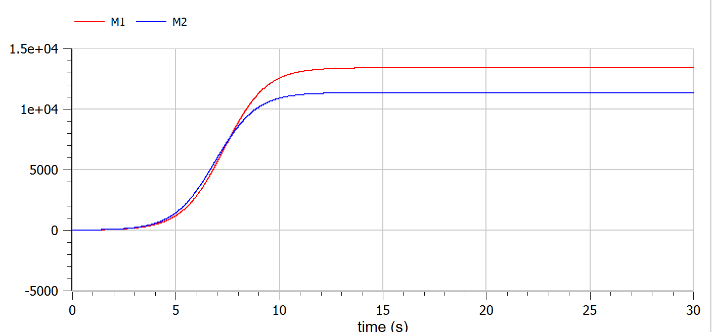
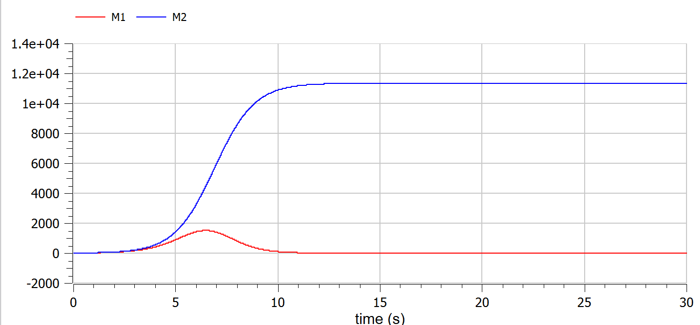

---
# Front matter
lang: ru-RU
title: Защита лабораторной работы №8. Модель конкуренции двух фирм
author: "Асеинова Елизавета Валерьевна"
group: NFIbd-01-19
institute: RUDN University, Moscow, Russian Federation
date: 2022 March 29th

# Formatting
toc: false
slide_level: 2
header-includes: 
 - \metroset{progressbar=frametitle,sectionpage=progressbar,numbering=fraction}
 - '\makeatletter'
 - '\beamer@ignorenonframefalse'
 - '\makeatother'
aspectratio: 43
section-titles: true
theme: metropolis

---

# Прагматика выполнения лабораторной работы

- Ознакомление с моделью конкуренции двух фирм
- Построение графиков для двух случаев

# Цель выполнения лабораторной работы 

В данной работе мы должны изучить модель конкуренции двух фирм и построить графики в среде OpenModelica.

# Задачи выполнения лабораторной работы

1. Постройте графики изменения оборотных средств фирмы 1 и фирмы 2 без учета постоянных издержек и с веденной нормировкой для случая 1.

2. Постройте графики изменения оборотных средств фирмы 1 и фирмы 2 без учета постоянных издержек и с веденной нормировкой для случая 2.

## Случай 1
Рассмотрим две фирмы, производящие взаимозаменяемые товары одинакового качества и находящиеся в одной рыночной нише. Считаем, что в рамках нашей модели конкурентная борьба ведётся только рыночными методами. То есть, конкуренты могут влиять на противника путем изменения параметров своего производства: себестоимость, время цикла, но не могут прямо вмешиваться в
ситуацию на рынке («назначать» цену или влиять на потребителей каким-либо иным способом.) Будем считать, что постоянные издержки пренебрежимо малы, и в модели учитывать не будем.

## Cлучай 1
В этом случае динамика изменения объемов продаж
фирмы 1 и фирмы 2 описывается следующей системой уравнений:

$$\frac{dM_1}{d\theta} = M_1 - \frac{b}{c_1}M_1M_2- \frac{a_1}{c_1}M_1^2$$
$$\frac{dM_2}{d\theta} = \frac{c_2}{c_1}M_2- \frac{b}{c_1}M_1M_2 - \frac{a_2}{c_1}M_2^2$$

## Случай 1
$$a_1 = \frac{p_{cr}}{\tau_1^2 p_1^2Nq},a_2 = \frac{p_{cr}}{\tau_2^2 p_2^2Nq}, b = \frac{p_{cr}}{\tau_1^2p_1^2\tau_2^2p^2_2Nq}$$

$$c_1 = \frac{p_{cr}-p_1}{\tau_1p_1}, c_2 = \frac{p_{cr}-p_2}{\tau_2p_2}$$

## Случай 2
Рассмотрим модель, когда, помимо экономического фактора
влияния (изменение себестоимости, производственного цикла, использованиекредита и т.п.), используются еще и социально-психологические факторы –формирование общественного предпочтения одного товара другому, не зависимо от
их качества и цены. В этом случае взаимодействие двух фирм будет зависеть друг от друга, соответственно коэффициент перед
M1M2 будет отличаться.

## Случай 2
Пусть в рамках рассматриваемой модели динамика изменения объемов продаж фирмы 1 и фирмы 2 описывается следующей системой уравнений:

$$\frac{dM_1}{d\theta} = M_1 - (\frac{b}{c_1} + 0,0002)M_1M_2- \frac{a_1}{c_1}M_1^2$$
$$\frac{dM_2}{d\theta} = \frac{c_2}{c_1}M_2- \frac{b}{c_1}M_1M_2 - \frac{a_2}{c_1}M_2^2$$

## Параметры

$$M_0^1 = 8.8, M_0^2 = 9.9$$
$$p_{cr} = 30, N = 80, q = 1$$
$$\tau_1 = 25, \tau_2 = 20$$
$$p_1 = 10.1, p_2 = 11.5$$

# Результат работы

## График для первого случая

## График для второго случая

# Выводы по лабораторной работе

- изучена модель конкуренции двух фирм

- построены графики для двух случаев