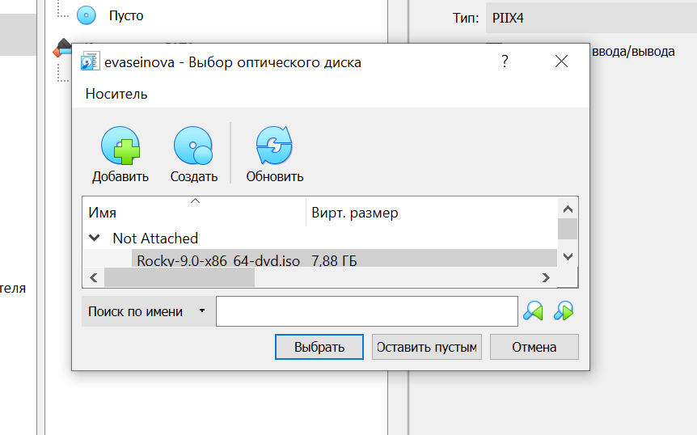

---
# Front matter
title: "Отчет по лабораторной работе №1"
subtitle: "Установка и конфигурация операционной системы на виртуальную машину"
author: "Асеинова Елизавета"
group: NFIbd-01-19
institute: RUDN University, Moscow, Russian Federation
date: 2022 Sep 6th

# Generic otions
lang: ru-RU
toc-title: "Содержание"

# Pdf output format
toc: true # Table of contents
toc_depth: 2
lof: true # List of figures
lot: true # List of tables
fontsize: 12pt
linestretch: 1.5
papersize: a4
documentclass: scrreprt
### Fonts
mainfont: PT Serif
romanfont: PT Serif
sansfont: PT Sans
monofont: PT Mono
mainfontoptions: Ligatures=TeX
romanfontoptions: Ligatures=TeX
sansfontoptions: Ligatures=TeX,Scale=MatchLowercase
monofontoptions: Scale=MatchLowercase,Scale=0.9
## Biblatex
biblatex: true
biblio-style: "gost-numeric"
biblatexoptions:
  - parentracker=true
  - backend=biber
  - hyperref=auto
  - language=auto
  - autolang=other*
  - citestyle=gost-numeric
## Misc options
indent: true
header-includes:
  - \linepenalty=10 # the penalty added to the badness of each line within a paragraph (no associated penalty node) Increasing the value makes tex try to have fewer lines in the paragraph.
  - \interlinepenalty=0 # value of the penalty (node) added after each line of a paragraph.
  - \hyphenpenalty=50 # the penalty for line breaking at an automatically inserted hyphen
  - \exhyphenpenalty=50 # the penalty for line breaking at an explicit hyphen
  - \binoppenalty=700 # the penalty for breaking a line at a binary operator
  - \relpenalty=500 # the penalty for breaking a line at a relation
  - \clubpenalty=150 # extra penalty for breaking after first line of a paragraph
  - \widowpenalty=150 # extra penalty for breaking before last line of a paragraph
  - \displaywidowpenalty=50 # extra penalty for breaking before last line before a display math
  - \brokenpenalty=100 # extra penalty for page breaking after a hyphenated line
  - \predisplaypenalty=10000 # penalty for breaking before a display
  - \postdisplaypenalty=0 # penalty for breaking after a display
  - \floatingpenalty = 20000 # penalty for splitting an insertion (can only be split footnote in standard LaTeX)
  - \raggedbottom # or \flushbottom
  - \usepackage{float} # keep figures where there are in the text
  - \floatplacement{figure}{H} # keep figures where there are in the text
---

# Цель работы

Целью данной работы является приобретение практических навыков установки операционной системы на виртуальную машину, настройки минимально необходимых для дальнейшей работы сервисов.

# Выполнение лабораторной работы

1. Укажем каталог для виртуальных машин.

2. Создадим новую виртуальную машину. Укажем имя виртуальной машины как логин из дисплейного класса, тип операционной системы — Linux, RedHat.

3. Зададим основную память виртуальной машины и конфигурацию жесткого диска.

4. Добавим новый привод оптических дисков и выберем образ операционной системы Linux Rocky.

5. Запустим виртуальную машину. В разделе выбора программ укажем в качестве базового окружения Server with GUI, а в качестве дополнения — Development Tools, отключим KDUMP, место установки ОС оставляем без изменения, установливаем пароль для root и пользователя с правами администратора. 

6. Перезапустим виртуальную машину и откроем терминал. С помощью команды dmesg проанализируем последовательность загрузки системы. С помощью команды grep получим информацию о версии ядра Linux, частоте процессора, модели процессора, объеме доступной оперативной памяти, типе обнаруженного гипервизора, типе файловой системы корневого раздела, и последовательности монтирования файловых систем.

# Выводы

В ходе работы мы приобрели практические навыки установки операционной системы на виртуальную машину и осуществили настройки минимально необходимых для дальнейшей работы сервисов.

# Контрольные вопросы

1. Учётная запись содержит сведения, необходимые для опознания пользователя при подключении к системе - логин и пароль.

2. Команды для:
-  для получения справки по команде - man
- для перемещения по файловой системе - cd
- для просмотра содержимого каталога - ls
- для определения объёма каталога - du
- для создания / удаления каталогов / файлов - mkdir, rm, touch
- для задания определённых прав на файл / каталог - chmod
- для просмотра истории команд - history

3. Файловая система — способ определения и контроля того, как будут храниться и именоваться данные на носителе/накопителе информации. 
От нее зависит способ хранения данных на накопителе, сам формат данных и то, как они будут записываться/читаться в дальнейшем. 
Например, «exFAT» – это сокращенное обозначение от полного английского названия «Extended File Allocation Table» («расширенная таблица размещения файлов»). Стандарт является обновленной версией файловой системы «FAT32», созданный корпорацией «Microsoft». Основными параметрами система «exFAT» чрезвычайно похожа на «FAT32». Но главным отличием является устранение ограничений, присутствующих в файловой системе «FAT32», что позволяет пользователям хранить файлы намного большего размера, чем четыре гигабайта.

4. Выполнить команду mount без параметров или выполнить команду df -a. Также можно посмотреть содержимое файла /etc/mtab. 

5. Используя в терминале команду $ kill -сигнал pid_процесса.

# Список литературы

1. Методические материалы курса