---
# Front matter
title: "Отчет по лабораторной работе №3"
subtitle: "Дискреционное разграничение прав в Linux. Два пользователя"
author: "Асеинова Елизавета"
group: NFIbd-01-19
institute: RUDN University, Moscow, Russian Federation
date: 2022 Sep 20th

# Generic otions
lang: ru-RU
toc-title: "Содержание"

# Pdf output format
toc: true # Table of contents
toc_depth: 2
lof: true # List of figures
lot: true # List of tables
fontsize: 12pt
linestretch: 1.5
papersize: a4
documentclass: scrreprt
### Fonts
mainfont: PT Serif
romanfont: PT Serif
sansfont: PT Sans
monofont: PT Mono
mainfontoptions: Ligatures=TeX
romanfontoptions: Ligatures=TeX
sansfontoptions: Ligatures=TeX,Scale=MatchLowercase
monofontoptions: Scale=MatchLowercase,Scale=0.9
## Biblatex
biblatex: true
biblio-style: "gost-numeric"
biblatexoptions:
  - parentracker=true
  - backend=biber
  - hyperref=auto
  - language=auto
  - autolang=other*
  - citestyle=gost-numeric
## Misc options
indent: true
header-includes:
  - \linepenalty=10 # the penalty added to the badness of each line within a paragraph (no associated penalty node) Increasing the value makes tex try to have fewer lines in the paragraph.
  - \interlinepenalty=0 # value of the penalty (node) added after each line of a paragraph.
  - \hyphenpenalty=50 # the penalty for line breaking at an automatically inserted hyphen
  - \exhyphenpenalty=50 # the penalty for line breaking at an explicit hyphen
  - \binoppenalty=700 # the penalty for breaking a line at a binary operator
  - \relpenalty=500 # the penalty for breaking a line at a relation
  - \clubpenalty=150 # extra penalty for breaking after first line of a paragraph
  - \widowpenalty=150 # extra penalty for breaking before last line of a paragraph
  - \displaywidowpenalty=50 # extra penalty for breaking before last line before a display math
  - \brokenpenalty=100 # extra penalty for page breaking after a hyphenated line
  - \predisplaypenalty=10000 # penalty for breaking before a display
  - \postdisplaypenalty=0 # penalty for breaking after a display
  - \floatingpenalty = 20000 # penalty for splitting an insertion (can only be split footnote in standard LaTeX)
  - \raggedbottom # or \flushbottom
  - \usepackage{float} # keep figures where there are in the text
  - \floatplacement{figure}{H} # keep figures where there are in the text
---

# Цель работы

Целью данной работы является получение практических навыков работы в консоли с атрибутами файлов для групп пользователей. [1]

# Выполнение лабораторной работы

1. В установленной при выполнении предыдущей лабораторной работы операционной системе создала учётную запись пользователя guest2, задала для него пароль, добавила пользователя guest2 в группу guest1. Вошла в систему от имени двух пользователей с разных консолей.

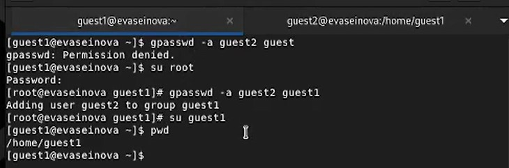

2. Определила директорию, в которой нахожусь, командой pwd в обеих консолях. Уточнила имя пользователя, его группу, а также группы, куда входит пользователь, командой id и group.

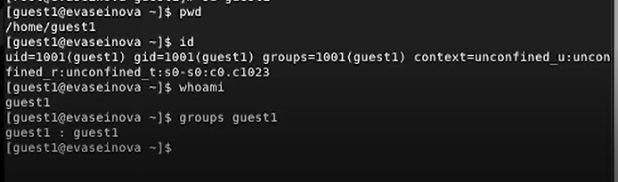

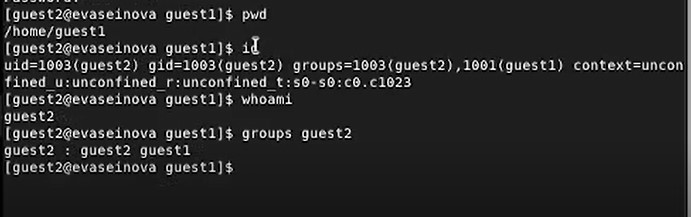

3. Просмотрела файл /etc/group. 

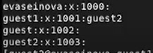

4. От имени пользователя guest2 выполнила регистрацию пользователя guest2 в группе guest. От имени пользователя guest изменила права директории /home/guest, разрешив все действия для пользователей группы,  сняла с директории /home/guest/dir1 все атрибуты 

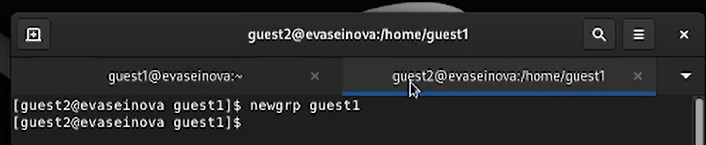

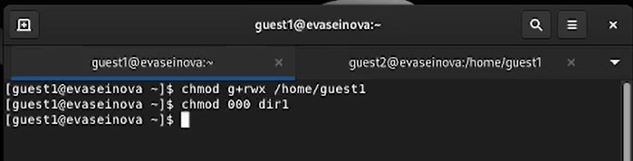

5. Заполнила таблицу «Установленные права и разрешённые действия», меняя атрибуты у директории dir1 и файла file1 от имени пользователя guest и делая проверку от пользователя guest2.

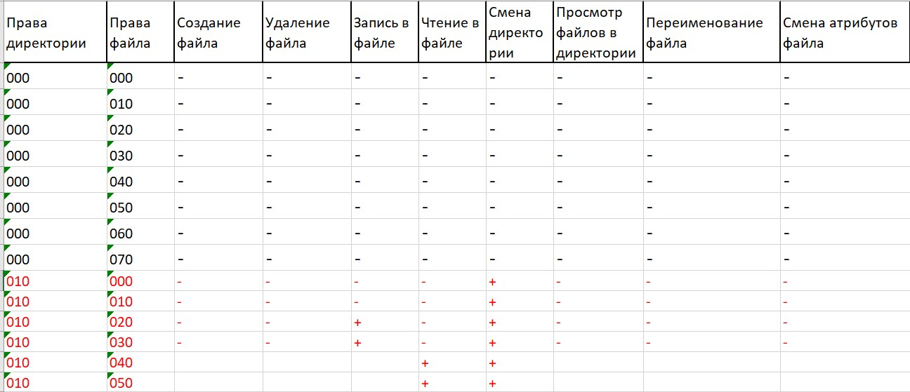

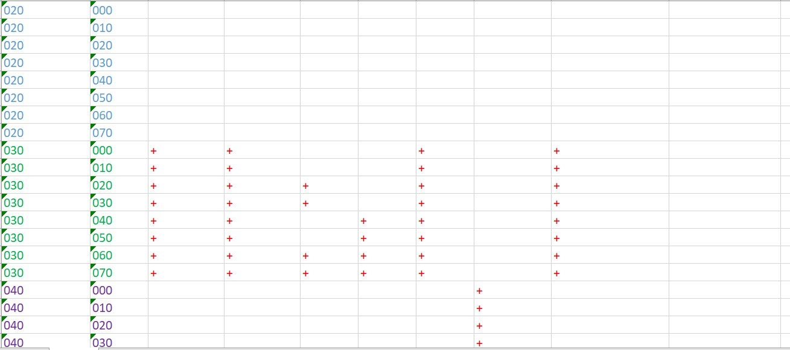

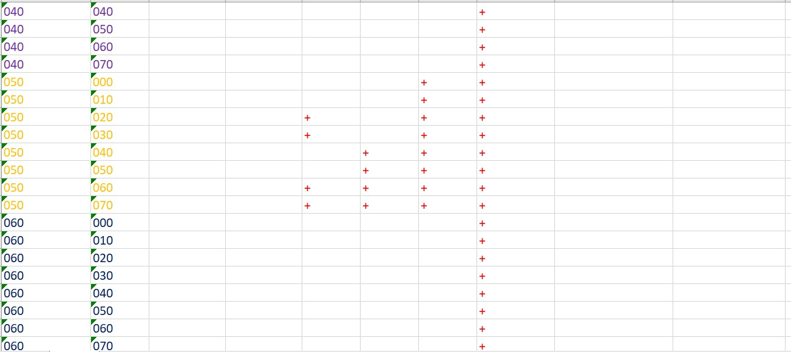

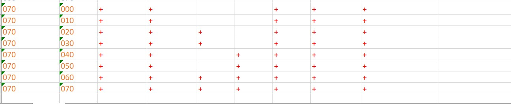

6. На основании заполненной таблицы определила те или иные минимально необходимые права для выполнения операций внутри директории.

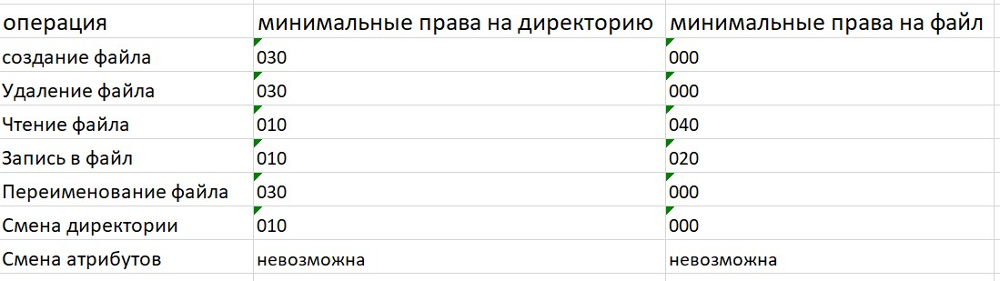

# Выводы

В ходе работы мы получили практические навыки работы в консоли с атрибутами файлов для групп пользователей.

# Список литературы

1. Методические материалы курса