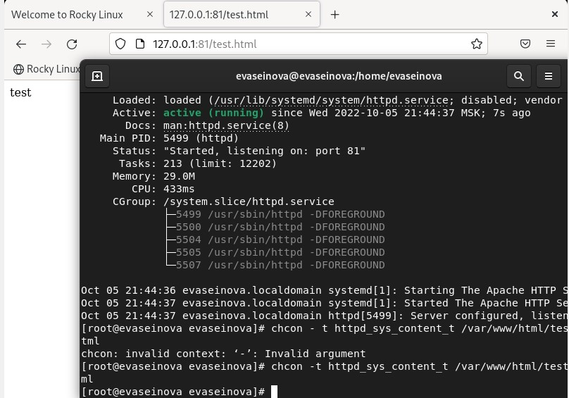

---
# Front matter
lang: ru-RU
title: Защита лабораторной работы №6. Мандатное разграничение прав в Linux
author: "Асеинова Елизавета"
group: NFIbd-01-19
institute: RUDN University, Moscow, Russian Federation
date: 2022 Oct 4th

# Formatting
toc: false
slide_level: 2
header-includes: 
 - \metroset{progressbar=frametitle,sectionpage=progressbar,numbering=fraction}
 - '\makeatletter'
 - '\beamer@ignorenonframefalse'
 - '\makeatother'
aspectratio: 43
section-titles: true
theme: metropolis

---

# Результат выполнения лабораторной работы №6

## Цель выполнения лабораторной работы 

Развить навыки администрирования ОС Linux. Получить первое практическое знакомство с технологией SELinux1. Проверить работу SELinx на практике совместно с веб-сервером Apache.

## Результат выполнения лабораторной работы

## Результат выполнения лабораторной работы

## Результат выполнения лабораторной работы

## Результат выполнения лабораторной работы

## Результат выполнения лабораторной работы

## Результат выполнения лабораторной работы

## Результат выполнения лабораторной работы

## Результат выполнения лабораторной работы

## Результат выполнения лабораторной работы

## Результат выполнения лабораторной работы

## Вывод 

В ходе работы мы развили навыки администрирования ОС Linux, получили первое практическое знакомство с технологией SELinux1, проверили работу SELinx на практике совместно с веб-сервером Apache.