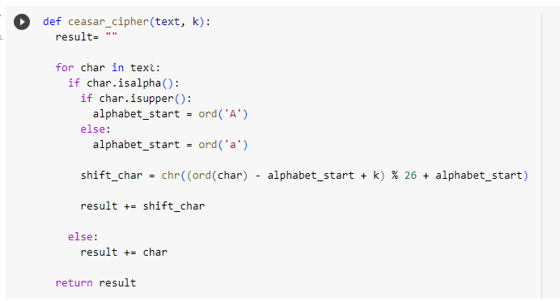
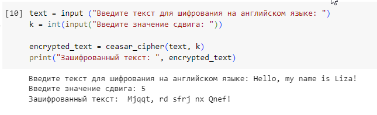
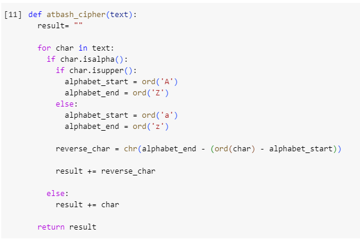
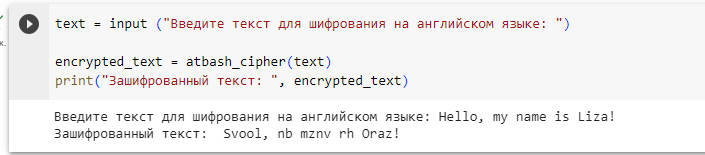

---
# Front matter
lang: ru-RU
title: Защита лабораторной работы №1. Шифры простой замены
author: "Асеинова Елизавета"
group: NFImd-01-23
institute: RUDN University, Moscow, Russian Federation
date: 2023 Sep 16th

# Formatting
toc: false
slide_level: 2
header-includes: 
 - \metroset{progressbar=frametitle,sectionpage=progressbar,numbering=fraction}
 - '\makeatletter'
 - '\beamer@ignorenonframefalse'
 - '\makeatother'
aspectratio: 43
section-titles: true
theme: metropolis

---

# Результат выполнения лабораторной работы №1

## Цель выполнения лабораторной работы 

Цель данной работы - ознакомиться с шифрами простой замены: шифр Цезаря и шифр Атбаш, а также научиться применять их на практике.

## Результат выполнения лабораторной работы

Прописан код для шифра Цезаря на языке программирования Python. 

{#fig:001 width=70%}

## Результат выполнения лабораторной работы

Выводим на экран результат применения шифра Цезаря для произвольного текста со сдвигом на значение k = 5.

{#fig:002 width=70%}

## Результат выполнения лабораторной работы

Прописан код для шифра Атбаш на языке программирования Python.

{#fig:003 width=70%}

## Результат выполнения лабораторной работы

Выводим на экран результат применения шифра Атбаш.

{#fig:004 width=70%}

## Вывод 

В рамках данной лабораторной работы было произведено ознакомление с шифром Цезаря и шифром Атбаш.
Оба шифра были реализованы на языке программирования Python.