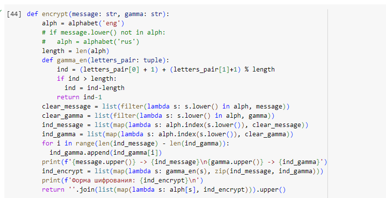
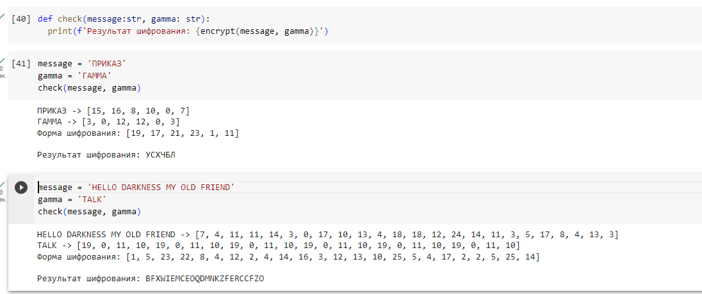

---
# Front matter
lang: ru-RU
title: Защита лабораторной работы №3
subtitle: Шифрование гаммированием 
author: "Асеинова Е.В."
institute: Российский университет дружбы народов, Москва, Россия
date: 14 октября 2023

# Formatting
toc: false
slide_level: 2
header-includes: 
 - \metroset{progressbar=frametitle,sectionpage=progressbar,numbering=fraction}
 - '\makeatletter'
 - '\beamer@ignorenonframefalse'
 - '\makeatother'
aspectratio: 43
section-titles: true
theme: metropolis

---

## Цель выполнения лабораторной работы

- Освоение шифрования гаммированием
- Программная реализация алгоритма ширования гаммированием конечной гаммой

## Теоретические сведения

Гаммирование - процедура наложения при помощи некоторой функции $F$ на исходный текст гаммы шифра, то есть псевдослучайной последовательности (ПСП) с выходом генератора $G$. Псевдослучайная последовательность по своим статистическим свойствам неотличима от случайной последовательности, но является детерминированной, то есть известен алгоритм ее формирования.

# Результат выполнения лабораторной работы

## Результат выполнения лабораторной работы

Алгоритм поиска зашифрованного текста на основе принципа формирования шифрования гаммирования:

{width=60%}

## Результат выполнения лабораторной работы

Пример шифрования:

{width=80%}

## Выводы

1. Изучили шифрование гаммированием
2. Реализовали алгоритм шифрования гаммированием конечной гаммой на языке Python
